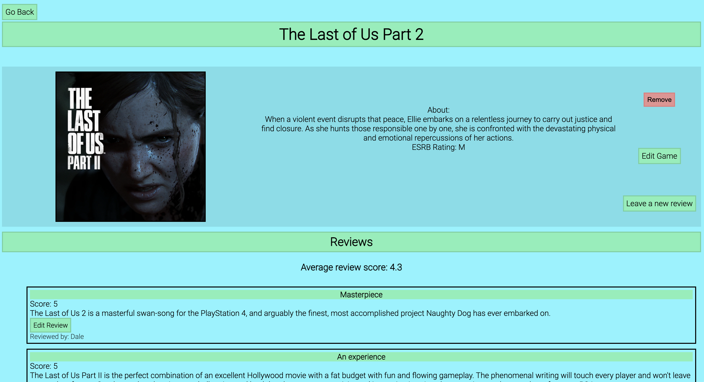

# Video Game Log

Video Game Log is an application that allows users to search through a list of  games and see descriptions, reviews, and scores for each game. Users are able to add reviews and scores for games they have played. If a game is not listed on the log, a user can add that game for their own and others' reviews.

Link to heroku deployment: [Video Game Log](https://vglog.herokuapp.com/games)

 # Visuals

### Main View

### Game Detail View

 # Technologies Used
  - HTML
  - CSS
  - JavaScript
  - EJS
  - Express
  - MongoDB

 # User Stories

 - As a user, I want to see a list of all the video games that are on the site.
 - As a user, I want to see my rating for the video games on that list
 - As a user, I should be able to add a new video game to the list
 - As a user, I should be able to add a review to a game
 - As a user, I should be able to delete video games that I no longer want
 - As a user, I should be able to edit a review for a game
 - As a user, I want to see how many video games are on the list
 - As a user, I want to be able to search for a video game on my list

 # Wireframe

 # Next Steps

 ### API Searching
 I found an API that I intend to use to make adding a game a more simplified process. Ideally, a user would be able to search for a game, making a request, and the API can respond with the game and fill in the model fields. The API is called [IGDB.](https://api-docs.igdb.com/#about)

 ### Filtering
 Users should be able to add filter criteria for their list of games. This could be done by adding tags to my game model and setting up javascript queries to filter for games with 'x' tag.

 ### User Authentication
 I want to add functionality for user authentication and look into implementing sessions. Users should only have the ability to add/edit games that they themselves added. I could implement a "password" feature until user auth can be implemented.

------------

#### Learnings
I learned a lot while working on through this project. Not only about the langauges and frameworks themselves but also how they interact with one another. For example, how your JavaScript needs to wait until after data from `get` requests have been gathered before manipulating it. I also learned about how important order is on your backend files. For example, the order of your routes can lead to a bug that cause routes to intertwine. 

Ultimately, I really enjoyed this project and I look forward to improving it.